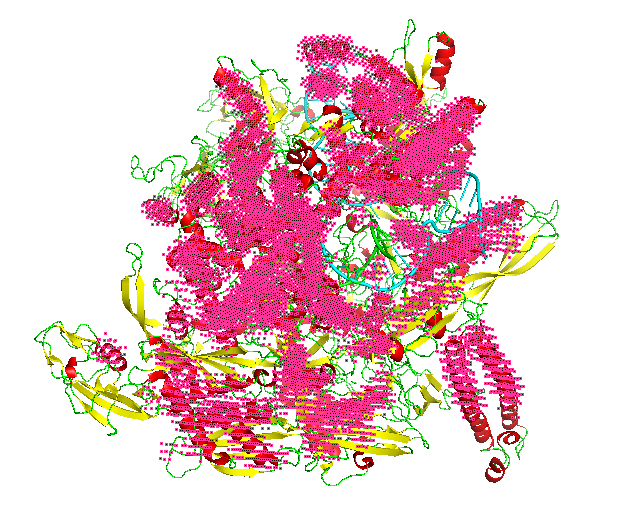

# Emap2sec+
<a href="https://github.com/marktext/marktext/releases/latest">
   
   
   
   
   
   
</a>           
<p align="center">
  
</p>

Emap2sec+ is a computational tool using deep learning that can accurately identify structures, alpha helices, beta sheets, other(coils/turns) and DNA/RNA, in cryo-Electron Microscopy (EM) maps of medium to low resolution.  

Copyright (C) 2020 Xiao Wang, Eman Alnabati, Tunde W Aderinwale, Sai Raghavendra Maddhuri, Genki Terashi, Daisuke Kihara, and Purdue University. 

License: GPL v3. (If you are interested in a different license, for example, for commercial use, please contact us.) 

Contact: Daisuke Kihara (dkihara@purdue.edu)

## Citation:

Xiao Wang, Eman Alnabati, Tunde W Aderinwale, Sai Raghavendra Maddhuri Venkata Subramaniya, Genki Terashi & Daisuke Kihara. Detecting protein and DNA/RNA structures in cryo-EM maps of intermediate resolution using deep learning. Nature Commununications 12, 2302 (2021). https://doi.org/10.1038/s41467-021-22577-3 [PDF](https://www.nature.com/articles/s41467-021-22577-3)
```
@article{wang2021emap2secplus,   
  title={Detecting Protein and DNA/RNA Structures in Cryo-EM Maps of Intermediate Resolution Using Deep Learning},   
  author={Xiao Wang, Eman Alnabati, Tunde W Aderinwale, Sai Raghavendra Maddhuri Venkata Subramaniya, Genki Terashi, and Daisuke Kihara},    
  journal={Nature Communications},    
  year={2021}    
}   
```

## Project website: http://kiharalab.org/emsuites/emap2secplus.php
## Online Platform: 
### 1 Colab: https://bit.ly/emap2secplus or https://github.com/kiharalab/Emap2secPlus/blob/master/Emap2sec%2B.ipynb
### 2 CodeOcean: https://doi.org/10.24433/CO.7165707.v1 

## Simulated Map Dataset: [](https://doi.org/10.5281/zenodo.4602627)

## Introduction
An increasing number of density maps of macromolecular structures, including proteins and protein and DNA/RNA complexes, have been determined by cryo-electron microscopy (cryo-EM). Although lately maps at a near-atomic resolution are routinely reported, there are still substantial fractions of maps determined at intermediate or low resolutions, where extracting structure information is not trivial. Here, we report a new computational method, Emap2sec+, which identifies DNA or RNA as well as the secondary structures of proteins in cryo-EM maps of 5 to 10 Å resolution. Emap2sec+ employs the deep Residual convolutional neural network. Emap2sec+ assigns structural labels with associated probabilities at each voxel in a cryo-EM map, which will help structure modeling in an EM map. Emap2sec+ showed stable and high assignment accuracy for nucleotides in low resolution maps and improved performance for protein secondary structure assignments than its earlier version when tested on simulated and experimental maps.

## Overall Protocol
```
(1) Preprocess cryo-EM map (*.mrc format;including remove density outside the contour level and change the grid size to 1);
(2) Scan EM map to get voxel input and corrsponding locations and save it in *.trimmap file;
(3) Generate *.input file which includes formatted 3D input for Network;
(4) Apply Phase1 Network and Phase2 Network to assign labels for each voxel and save the predictions in *pred.txt;
(5) Output *.pdb and *.pml file to visualize predictions;
(6) Output the evaluation report in *report.txt (if with PDB structure).
```
<p align="center">
  
</p> 

## Overall Network Framework
<p align="center">
  
</p> 

### Network Framework consists of 4 steps:   

```
(1) Apply binary-class model and multi-class model to obtain predicted probabilities for each voxel;
(2) Concatenate probability values from different models to have 8 probability values for each voxel;
(3) Apply Phase 2 network to utilize the neighboring predicted probabilities from phase 1 to further classify each voxel;
(4) Output the final predictions for each voxel.
```

### Phase 1 Network Architecture
<p align="center">
  
</p> 

### Phase 2 Network Architecture
<p align="center">
  
</p> 

## Pre-required software
Python 3 : https://www.python.org/downloads/    
pdb2vol (for generating simulated maps): https://situs.biomachina.org/fguide.html   
Pymol(for visualization): https://pymol.org/2/        

## Installation  
### 1. [`Install git`](https://git-scm.com/book/en/v2/Getting-Started-Installing-Git) 
### 2. Clone the repository in your computer 
```
git clone git@github.com:kiharalab/Emap2secPlus.git && cd Emap2secPlus
```

### 3. Build dependencies.   
You have two options to install dependency on your computer:
#### 3.1 Install with pip and python(Ver 3.6.9).
##### 3.1.1[`install pip`](https://pip.pypa.io/en/stable/installing/).
##### 3.1.2  Install dependency in command line.
```
pip3 install -r requirements.txt --user
```
If you encounter any errors, you can install each library one by one:
```
pip3 install mrcfile==1.1.2
pip3 install numpy==1.18.5
pip3 install numba
pip3 install torch==1.1.0
pip3 install scipy==1.4.1
pip3 install scikit-learn
```

#### 3.2 Install with anaconda
##### 3.2.1 [`install conda`](https://docs.conda.io/projects/conda/en/latest/user-guide/install/macos.html). 
##### 3.2.2 Install dependency in command line
```
conda create -n Emap python=3.6.9
conda activate Emap
pip install -r requirements.txt 
conda install pytorch==1.1.0 cudatoolkit=10.0 -c pytorch
```
Each time when you want to run my code, simply activate the environment by
```
conda activate Emap
conda deactivate(If you want to exit) 
```
Note that CUDA 10 is needed for the software. If your system-wide installation has a different version, you might need to intall CUDA 10 with conda if you want to keep the current system version.

#### 4. Downloading the model files and example files.
Due to the data quota limit of github, our model can't be kept in this repo. Please download them [here](https://kiharalab.org/emsuites/emap2secplus_model/) and put them in the Emap2secPlus directory. Two different types of model are included here. best_model.tar.gz includes all trained models based on author recommended contour level. nocontour_best_model.tar.gz	includes all trained models without the author contour level.

## Data Avilability
The raw data of the structure models built by our method are provided in Supplementary Information, Supp. Table 1 and 4. The simulated EM maps can be downloaded in https://doi.org/10.5281/zenodo.4599657). The experimental EM maps can be downloaded from EMDB (https://www.emdataresource.org/). The data that support the findings of this study are available from the corresponding author upon request. 

## Usage
```
python3 main.py -h:
  -h, --help            show this help message and exit
  -F F                  map path
  --mode MODE           0: Detect structures for EM Map 
                        1: Detect and evaluate structures for EM map with pdb structure
                        2: Detect structure for experimental maps with 4 fold models
                        3: Detect and evaluate structure for experimental maps with 4 fold models
                        4: Detect protein and DNA/RNA with 4 fold models
  -P P                  native structure path (PDB format) for evaluating model's performance (usually not available for real scenarios)
  -M                    Trained model path which saved all the trained models
  --type TYPE           0:simulated map at 6 Å 1: simulated map at 10 Å 2:simulated map at 6-10 Å 3:experimental map
  --gpu GPU             gpu id choose for training
  --class CLASS         number of classes
  --batch_size BATCH_SIZE batch size for training
  --contour CONTOUR     Contour level for real map
  --fold FOLD           specify the fold model used for detecting the experimental map
  --output_folder       specify a custom folder where results will be stored (optional, default will be located in project root and name will depend on mode)
  --no_compilation      using this optional argument will skip automatic compilation before running the project
```

### 1. Detect structures with EM maps
```
python3 main.py --mode=0 -F=[Map_path] --type=[Map_Type] --gpu=0 --class=4 --contour=[contour_level] --fold=[Choose_Fold]
```
Here [Map_path] is the cryo-EM map file path in your computer. [Map_Type] should be specified based on your input map type, which will be used to load proper pre-trained model. [contour_level] and [Choose_Fold] only need to be specified for experimental maps.             
Output will be saved in "Predict_Result/[Map_Type]/[Input_Map_Name]".       
### 2. Evaluate Performance (only when the correct underlined structure in the map is known)
#### In the case that you are testing the software with a case, you can check the accuracy of the structure detection by Emap2sec+ by comparing the result with the known structure. This mode cannot be used in real scenarios where the native structure is not available. We usually use the mode to evaluate Emap2sec+ performance on testing dataset with known structures to verify its performance. This mode is also useful to measure the difference of the detected structure by Emap2sec+ with the structure currently assigned to the EM map.
```
python3 main.py --mode=1 -F=[Map_path] -P=[PDB_path] --type=[Map_Type] --gpu=0 --class=4 --contour=[contour_level] --fold=[Choose_Fold]
```
Here [PDB_path] is the PDB file path for known structure. All other parameters should follow the same rule in --mode=0.     
Output will be saved in "Predict_Result_WithPDB/[Map_Type]/[Input_Map_Name]". 

### 3. Detect structure for experimental maps with 4 fold networks
```
python3 main.py --mode=2 -F=[Map_path] --type=3 --gpu=0 --class=4 --contour=[contour_level]
```    
The backend program will automatically call 4 fold networks and aggregate the final detection probabilities by majority vote of 4 networks. Output will be saved in "Predict_Result_WithPDB/REAL/[Input_Map_Name]". 

### 4. Evaluate performance for experimental maps with 4 fold networks
#### In the case that you are testing the software with a case, you can check the accuracy of the structure detection by Emap2sec+ by comparing the result with the known structure. This mode cannot be used in real scenarios where the native structure is not available. We usually use the mode to evaluate Emap2sec+ performance on testing dataset with known structures to verify its performance. This mode is also useful to measure the difference of the detected structure by Emap2sec+ with the structure currently assigned to the EM map.
```
python3 main.py --mode=3 -F=[Map_path] -P=[PDB_path] --type=3 --gpu=0 --class=4 --contour=[contour_level] 
```
The backend program will automatically call 4 fold networks and aggregate the final detection probabilities by majority vote of 4 networks. Also, the individual evaluation and combined evaluation will be automatically executed by Emap2sec+. Output will be saved in "Predict_Result_WithPDB/REAL/[Input_Map_Name]". 

### 5. Detect Protein+DNA/RNA for experimental maps with 4 fold networks
```
python3 main.py --mode=4 -F=[Map_path] --type=3 --gpu=0 --class=4 --contour=[contour_level]
```    
The backend program will automatically call 4 fold networks and aggregate the final detection probabilities by majority vote of 4 networks. Output will be saved in "Predict_Result_WithPDB/REAL/Binary/[Input_Map_Name]". This mode will only output the detection for two classes: protein+DNA/RNA.

### 6. Detect Structures for experimental maps without contour level (only for experimental maps).
#### 6.1 Detect Structures with only 1 fold network
```
python3 main.py --mode=0 -F=[Map_path] -M=[model_path] --type=3 --gpu=0 --class=4 --contour=0 --fold=[Choose_Fold]
```
Here [Map_path] is the cryo-EM map file path in your computer. [model_path] should be specified based on the trained model location downloaded from [kiharalab](https://kiharalab.org/emsuites/emap2secplus_model/nocontour_best_model.tar.gz). [Choose_Fold] is used to specify the fold model used for inference.             
Output will be saved in "Predict_Result/[Map_Type]/[Input_Map_Name]".       
#### 6.2 Detect Structures with 4 fold networks
```
python3 main.py --mode=2 -F=[Map_path] -M=[model_path] --type=3 --gpu=0 --class=4 --contour=0
```    
The backend program will automatically call 4 fold networks and aggregate the final detection probabilities by majority vote of 4 networks. [model_path] should be specified based on the trained model location downloaded from [kiharalab](https://kiharalab.org/emsuites/emap2secplus_model/nocontour_best_model.tar.gz).    
 Output will be saved in "Predict_Result_WithPDB/REAL/[Input_Map_Name]".
#### 6.3 Detect Protein+DNA/RNA for experimental maps with 4 fold networks
```
python3 main.py --mode=4 -F=[Map_path] -M=[model_path]  --type=3 --gpu=0 --class=4 --contour=0
```    
The backend program will automatically call 4 fold networks and aggregate the final detection probabilities by majority vote of 4 networks. Output will be saved in "Predict_Result_WithPDB/REAL/Binary/[Input_Map_Name]". This mode will only output the detection for two classes: protein+DNA/RNA.


## Example

### Download Example
All the example can be downloaded in our [kiharalab](https://kiharalab.org/github_data/emap2secplus_data/) website.
All the example output can also be downloaded in our [kiharalab](https://kiharalab.org/github_data/emap2secplus_predict_example/) website.

### Input File
Cryo-EM map with mrc format. 

### Output File 
1 *pred.txt: A text file that records detected structure labels by Emap2sec+ for each voxel. Format: [coordinate pred_label pred_prob_value] in each line.  
2 *.pdb: a PDB file that records voxel coordinates and detected structure labels.
3 *.pml: Script for visualizing detected structures using Pymol. Please use "pymol -u .pml" to visualize the detection results.
```
pymol -u *.pml
```


### Simulated map example (10Å resolution)
#### 1 Emap2sec+ Detection
Command line
```
python3 main.py --mode=0 -F=test_example/SIMU10/5T5K.mrc --type=1 --gpu=0 --class=4 
```
The example input map is included in [5T5K](https://kiharalab.org/github_data/emap2secplus_data/SIMU10).Our detailed results are saved in [5T5K_Result](https://kiharalab.org/github_data/emap2secplus_predict_example/SIMU10).

#### 2 Visualize Result
Results are saved in Predict_Result/SIMU10/[Input_Map_Name]. Phase 1 and Phase 2 visualization results (Pymol sessions) are saved in “Phase1” and “Phase2” sub-directory, respectively. You will find generated *.pml files generated to visualize. Please use “pymol -u *.pml” to visualize the final structure detection result. If you want to only see very confident detection results, run “pymol -u *C.pml” using another visualization file named "*C.pml", which only includes confident detections with a probability>=0.9.

#### 3 Evaluate Performance(only when the correct underlined structure in the map is known)

#####  In the case that you are testing the software with a case, you can check the accuracy of the structure detection by Emap2sec+ by comparing the result with the known structure. This mode cannot be used in real scenarios where the native structure is not available. We usually use the mode to evaluate Emap2sec+ performance on testing dataset with known structures to verify its performance. This mode is also useful to measure the difference of the detected structure by Emap2sec+ with the structure currently assigned to the EM map.
Command line:
```
python3 main.py --mode=1 -F=test_example/SIMU10/5T5K.mrc -P=test_example/SIMU10/5t5k.pdb --type=1 --gpu=0 --class=4 
```
In the Predict_Result_WithPDB/SIMU10/[Input_Map_Name], our evaluation report will be saved in *_report.txt. Here is an example of our evaluation report of 5T5K.
<p align="center">
  
</p> 

Here the precision is the fraction of correct predicted structures among the specific predicted structure, while recall (also known as sensitivity) is the fraction of the total amount of the specific structure that were actually retrieved. The F1 score is the harmonic mean of the precision and recall. The support is the number of voxels with the structure label. The macro measurement means macro-averaging(taking all classes as equally important), while the micro means mirco-averaging (biased by class frequency).

#### 4 Visualization
<p align="center">
  
</p> 

<p align="center">
  
</p> 

### Experimental map example
#### 1 Emap2sec+ Detection
Command line:
```
python3 main.py --mode=0 -F=test_example/REAL/6BJS.mrc --type=3 --gpu=0 --class=4 --fold=3 -–contour=0.006 
```
The example input map is included in [6BJS](https://kiharalab.org/github_data/emap2secplus_data/REAL), which is in the fold 3 testing dataset. Our detailed results are saved in [6BJS_Result](https://kiharalab.org/github_data/emap2secplus_predict_example/REAL).

#### 2 Visualize Result
Results are saved in Predict_Result/REAL/Fold3_Model_Result/[Input_Map_Name]. Phase 1 and Phase 2 visualization results (Pymol sessions) are saved in “Phase1” and “Phase2” sub-directory, respectively. You will find generated *.pml files generated to visualize. Please use “pymol -u *.pml” to visualize the final structure detection result. If you want to only see very confident detection results, run “pymol -u *C.pml” using another visualization file named "*C.pml", which only includes confident detections with a probability>=0.9.

#### 3 Evaluate Performance(only when the correct underlined structure in the map is known) 
##### In the case that you are testing the software with a case, you can check the accuracy of the structure detection by Emap2sec+ by comparing the result with the known structure. This mode cannot be used in real scenarios where the native structure is not available. We usually use the mode to evaluate Emap2sec+ performance on testing dataset with known structures to verify its performance. This mode is also useful to measure the difference of the detected structure by Emap2sec+ with the structure currently assigned to the EM map.
Command line:
```
python3 main.py --mode=1 -F=test_example/REAL/6BJS.mrc -P=test_example/REAL/6bjs.pdb  --type=3  --gpu=0 --class=4 -–fold=3 -–contour=0.006
```
In the Predict_Result_WithPDB/REAL/Fold3_Model_Result/[Input_Map_Name], our evaluation report will be saved in *_report.txt. Here is an example of our evaluation report of 6BJS.
<p align="center">
  
</p> 

Here the precision is the fraction of correct predicted structures among the specific predicted structure, while recall (also known as sensitivity) is the fraction of the total amount of the specific structure that were actually retrieved. The F1 score is the harmonic mean of the precision and recall. The support is the number of voxels with the structure label. The macro measurement means macro-averaging(taking all classes as equally important), while the micro means mirco-averaging (biased by class frequency).

#### 4 Visualization

<p align="center">
  
</p> 

<p align="center">
  
</p> 

### Experimental map example with majority vote
### \*Recommended when applying Emap2sec+ for experimental maps\*
#### 1 Emap2sec+ Detection
Command line:
```
python3 main.py --mode=2 -F=test_example/REAL_Vote/5WCB.mrc --type=3 --gpu=0 --class=4 -–contour=0.0332
```
The example input map is included in [5WCB](https://kiharalab.org/github_data/emap2secplus_data/REAL_Vote), which is a previous example in Emap2sec paper. This example also proves our method can work on EM maps without DNA/RNA. Our output results are saved in [Real_Vote](https://kiharalab.org/github_data/emap2secplus_predict_example/REAL_Vote).

#### 2 Visualize Result
Results are saved in Predict_Result/REAL/[Input_Map_Name]. Phase 1 and Phase 2 visualization results (Pymol sessions) are saved in “Phase1” and “Phase2” sub-directory, respectively. You will find generated *.pml files generated to visualize. Please use “pymol -u *.pml” to visualize the final structure detection result. If you want to only see very confident detection results, run “pymol -u *C.pml” using another visualization file named "*C.pml", which only includes confident detections with a probability>=0.9.

#### 3 Evaluate Performance (only when the correct underlined structure in the map is known) 
##### In the case that you are testing the software with a case, you can check the accuracy of the structure detection by Emap2sec+ by comparing the result with the known structure. This mode cannot be used in real scenarios where the native structure is not available. We usually use the mode to evaluate Emap2sec+ performance on testing dataset with known structures to verify its performance. This mode is also useful to measure the difference of the detected structure by Emap2sec+ with the structure currently assigned to the EM map.
 
Command line:
```
python3 main.py --mode=3 -F=test_example/REAL_Vote/5WCB.mrc -P=test_example/REAL_Vote/5wcb.pdb --type=3  --gpu=0 --class=4 -–contour=0.0332
```
In the Predict_Result_WithPDB/REAL/[Input_Map_Name], our evaluation report will be saved in *_report.txt. Here is an example of our evaluation report of 5WCB.
<p align="center">
  
</p> 

Here the precision is the fraction of correct predicted structures among the specific predicted structure, while recall (also known as sensitivity) is the fraction of the total amount of the specific structure that were actually retrieved. The F1 score is the harmonic mean of the precision and recall. The support is the number of voxels with the structure label. The macro measurement means macro-averaging(taking all classes as equally important), while the micro means mirco-averaging (biased by class frequency).

#### 4 Visualization

<p align="center">
  
</p> 

<p align="center">
  
</p> 

